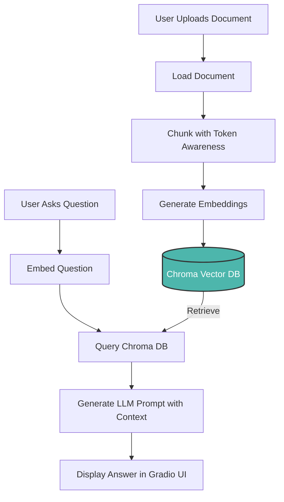

# 📄 ragify-docs — Domain-Aware Chat with Your Own Documents
[](https://github.com/anandan-bs/ragify-docs/actions/workflows/main.yml)

**ragify-docs** is a RAG (Retrieval-Augmented Generation) powered AI assistant that lets you upload your documents, index their content locally, and ask questions with full context awareness using hybrid LLMs — either OpenAI or Ollama.

---

## 🚀 Why Use ragify-docs Instead of Public LLM Chat?

### ✅ Traditional Chatbots (like ChatGPT or Claude):
- Do **not remember your documents** unless you paste content manually.
- **Consume more tokens**, especially when repeating context in each query.
- **Do not fine-tune or remember** past documents unless part of ongoing sessions.
- Your inputs are sometimes **used for model improvement** (unless settings are disabled).

### ✅ ragify-docs with RAG:
- 🧠 **Injects context** from your indexed documents dynamically — no retraining required.
- 🔒 **Runs locally with Ollama**, or optionally uses OpenAI (no document content sent to OpenAI APIs).
- 💸 **Reduces token usage** with smart chunking and retrieval.
- 📂 Supports **PDFs, DOCX, TXT, MD**, and **Google Docs**.
- 📈 OpenAI Completions API guarantees your content is **not used for training** when using API keys.

---

## 📦 Features

- 📄 Ingest your private documents into a local vector store (ChromaDB)
- 🤖 Ask natural language questions and get answers from context
- 🔁 Session history with saving and loading
- 💬 Hybrid LLM inference (Ollama local or OpenAI fallback)
- 🧠 Smart embedding fallback (Ollama or SentenceTransformer)
- 📤 Export conversations as Markdown or TXT

---

## 🛠️ Installation

```bash
git clone https://github.com/anandan-bs/ragify-docs.git
cd ragify-docs

# Install dependencies
pip install -r requirements.txt

# or using make
make setup
```

---

## ⚙️ Configuration

Create a `.env` file (or pass env vars directly):

```env
# Required for OpenAI API access
OPENAI_API_KEY=your_openai_api_key

# Required for Hugging Face model downloads
HUGGINGFACE_TOKEN=your_huggingface_token

# Optional: Set to 'false' to disable tokenizer parallelism
TOKENIZERS_PARALLELISM='false'
```

These can also be overridden in `ragify_docs/config.py` using `pydantic.BaseSettings`.

---

## 🧩 Directory Structure

```
ragify-docs/
├── ragify_docs/
│   ├── core/                  # Core functionality modules
│   │   ├── __init__.py
│   │   ├── chunk.py          # Text chunking utilities
│   │   ├── embed.py          # Embedding functionality
│   │   ├── load_doc.py       # Document loading utilities
│   │   ├── ollama.py         # Ollama API integration
│   │   ├── openai.py         # OpenAI API integration
│   │   ├── store.py          # Vector store operations
│   │   └── tokenize.py       # Tokenization utilities
│   ├── __init__.py
│   ├── config.py             # Application configuration
│   ├── inference.py          # RAG inference logic
│   ├── ingest.py             # Document ingestion pipeline
│   └── main.py               # Gradio UI and application entry point
├── .data/                    # Local model storage, auto-generated
├── Makefile                  # Development commands
├── README.md                 # This file
├── requirements.txt          # Python dependencies
├── setup.py                  # Package installation
└── setup_model.py            # Model setup script
```

---

## 🧪 How It Works (Workflow)



---

## 🚀 Running the App

```bash
# Navigate to the project root (if not already there)
cd ragify-docs
python3 setup_model.py
python3 ragify_docs.py


# or using make
make run
```

Then open your browser at [http://localhost:7860](http://localhost:7860)

---

## 📌 Notes

- Ollama must be installed and running if `use_ollama = True`
- OpenAI completions use API key securely and **do not send full documents**
- Chroma vector DB and document indexing happen **entirely locally**

---

## 👥 Author

**Anandan B S**
- Email: anandanklnce@gmail.com
- GitHub: [@anandan-bs](https://github.com/anandan-bs)

---

## 📜 License

MIT License
