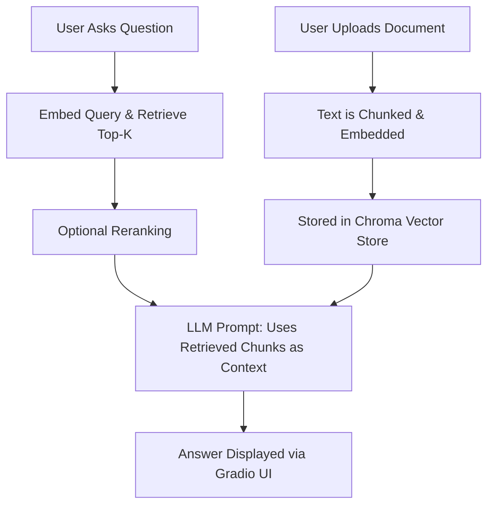

# 📄 ragify-docs — Domain-Aware Chat with Your Own Documents

**ragify-docs** is a RAG (Retrieval-Augmented Generation) powered AI assistant that lets you upload your documents, index their content locally, and ask questions with full context awareness using hybrid LLMs — either OpenAI or Ollama.

---

## 🚀 Why Use ragify-docs Instead of Public LLM Chat?

### ✅ Traditional Chatbots (like ChatGPT or Claude):
- Do **not remember your documents** unless you paste content manually.
- **Consume more tokens**, especially when repeating context in each query.
- **Do not fine-tune or remember** past documents unless part of ongoing sessions.
- Your inputs are sometimes **used for model improvement** (unless settings are disabled).

### ✅ ragify-docs with RAG:
- 🧠 **Injects context** from your indexed documents dynamically — no retraining required.
- 🔒 **Runs locally with Ollama**, or optionally uses OpenAI (no document content sent to OpenAI APIs).
- 💸 **Reduces token usage** with smart chunking and retrieval.
- 📂 Supports **PDFs, DOCX, TXT, MD**, and **Google Docs**.
- 📈 OpenAI Completions API guarantees your content is **not used for training** when using API keys.

---

## 📦 Features

- 📄 Ingest your private documents into a local vector store (ChromaDB)
- 🤖 Ask natural language questions and get answers from context
- 🔁 Session history with saving and loading
- 💬 Hybrid LLM inference (Ollama local or OpenAI fallback)
- 🧠 Smart embedding fallback (Ollama or SentenceTransformer)
- 📤 Export conversations as Markdown or TXT

---

## 🛠️ Installation

```bash
git clone https://github.com/your-username/ragify-docs.git
cd ragify-docs

# Install dependencies
pip install -r requirements.txt

# or using poetry
poetry install
```

---

## ⚙️ Configuration

Create a `.env` file (or pass env vars directly):

```env
OPENAI_API_KEY=your_openai_api_key
OLLAMA_BASE_URL=http://localhost:11434
OLLAMA_MODEL=llama3
OLLAMA_EMBED_MODEL=nomic-embed-text
```

These can also be overridden in `config.py` using `pydantic.BaseSettings`.

---

## 🧩 Directory Structure

```
project_root/
├── app/
│   ├── config.py        # environment & model settings
│   ├── embedder.py      # local embedding logic
│   ├── retriever.py     # Chroma vector DB querying
│   ├── ingest.py        # parse, chunk & embed documents
│   ├── reranker.py      # optional semantic reranking
│   ├── inference.py     # RAG controller logic
│   ├── rag/
│   │   ├── openai.py    # OpenAI API wrapper
│   │   └── ollama.py    # Ollama API wrapper
├── sessions/            # saved chat logs
├── exports/             # exported chat sessions
├── chroma_storage/      # persisted Chroma vector data
├── app.py               # Gradio UI frontend
├── requirements.txt
└── pyproject.toml
```

---

## 🧪 How It Works (Workflow)



---

## 🚀 Running the App

```bash
# Navigate to the project root (if not already there)
cd path/to/ragify-docs

# Launch the Gradio app
python app.py
```

Then open your browser at [http://localhost:7860](http://localhost:7860)

---

## 📌 Notes

- Ollama must be installed and running if `use_ollama = True`
- OpenAI completions use API key securely and **do not send full documents**
- Chroma vector DB and document indexing happen **entirely locally**

---

## 👥 Author

**Anandan B S**
- Email: anandanklnce@gmail.com
- GitHub: [@anandan-bs](https://github.com/anandan-bs)

---

## 📜 License

MIT License
